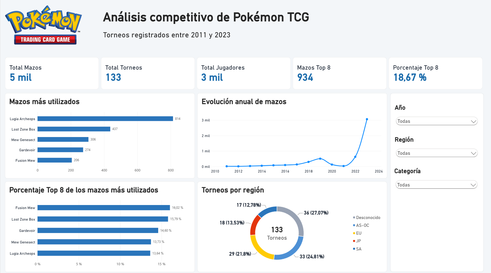
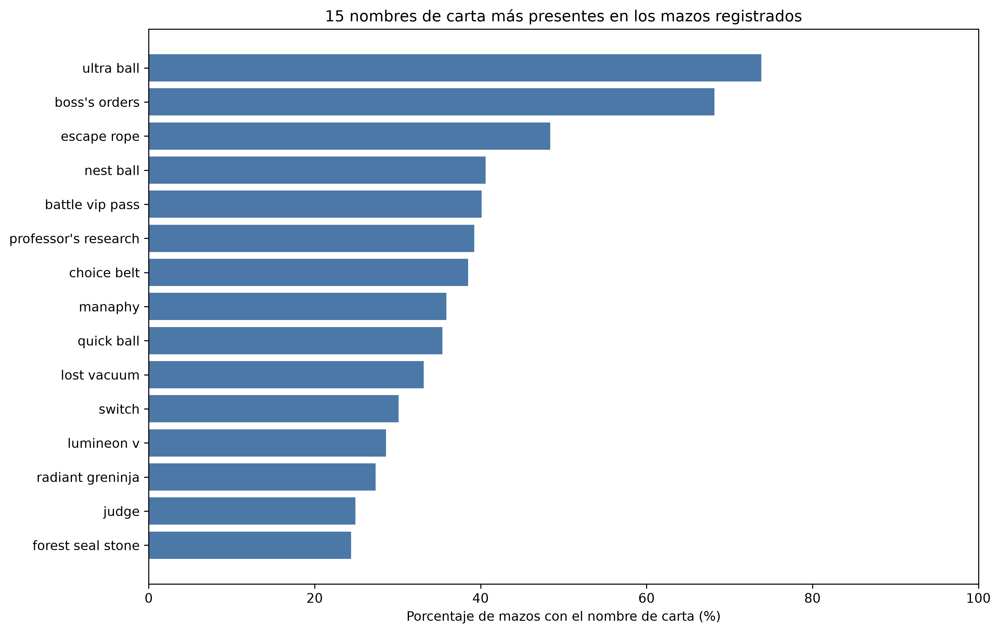
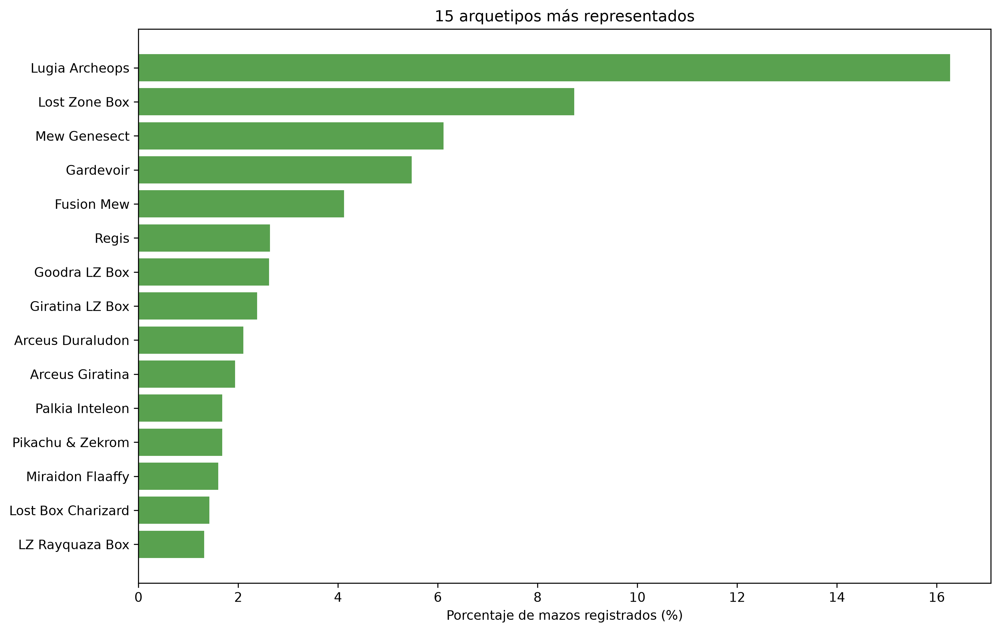
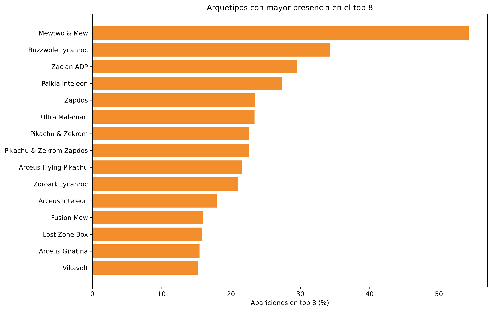

# Análisis competitivo de Pokémon TCG

Proyecto final del Máster en Data Analytics de ThePower. El objetivo es analizar la presencia de cartas y arquetipos de mazos en torneos de Pokémon TCG registrados entre 2011 y 2023.

El proyecto reúne dos conjuntos de datos independientes, realiza su limpieza y unión con Python y presenta los principales resultados mediante un análisis exploratorio, un análisis estadístico y un dashboard interactivo desarrollado en Power BI.



## Objetivos

- Limpiar y transformar los datos originales de torneos y del catálogo de cartas.
- Unir las dos fuentes sin perder los registros de torneos.
- Identificar las cartas y los arquetipos más frecuentes.
- Comparar la popularidad de los mazos con su presencia en el Top 8.
- Analizar la evolución de los registros entre 2011 y 2023.
- Crear un dashboard que permita consultar los resultados por año, región y categoría.

## Fuentes de datos

Se utilizaron dos conjuntos de datos publicados por autores diferentes en Kaggle:

1. [Pokémon TCG - All Tournaments Decks 2011-2023](https://www.kaggle.com/datasets/enriccogemha/pokemon-tcg-all-tournaments-decks-2011-2023?resource=download)

   Contiene una fila por cada carta incluida en los mazos registrados en torneos. El archivo original tiene 114.291 filas y 26 columnas.

2. [Pokémon TCG All Cards 1999-2023](https://www.kaggle.com/datasets/adampq/pokemon-tcg-all-cards-1999-2023)

   Catálogo con información de 17.172 cartas y 29 columnas, incluyendo expansión, artista, rareza, tipos y otros datos de cada edición.

Los archivos originales se conservan sin modificar en `datos/brutos/`.

## Herramientas utilizadas

- Python
- Pandas
- NumPy
- Matplotlib
- Jupyter Notebook
- Visual Studio Code
- Power BI Desktop
- Git y GitHub

## Estructura del proyecto

```text
proyecto_final_data_analytics-TPMBA/
├── dashboard/
│   └── tcg_pokemon_dashboard.pbix
├── datos/
│   ├── brutos/
│   │   ├── tournaments.csv
│   │   ├── pokemon-tcg-data-master 1999-2023.csv
│   │   └── pokemon-tcg-data-master 1999-2023 Data Dictionary.txt
│   └── procesados/
│       ├── pokemon_tcg_completo.csv
│       └── pokemon_tcg_mazos.csv
├── imagenes/
│   ├── 01_presencia_cartas.png
│   ├── 02_evolucion_anual_cartas.png
│   ├── 03_arquetipos_frecuentes.png
│   ├── 04_arquetipos_top8.png
│   ├── 05_arquetipo_principal_anual.png
│   └── captura_dashboard.png
├── informe/
│   └── analisis_pokemon_tcg.pdf
├── notebooks/
│   └── 01_eda_pokemon_tcg.ipynb
└── README.md
```

## Proceso seguido

### 1. Exploración inicial

Se revisaron las dimensiones, los tipos de datos, los valores ausentes y las filas duplicadas de las dos fuentes.

El archivo de torneos contenía 84 filas completamente duplicadas. Después de eliminarlas quedaron 114.207 registros.

### 2. Limpieza de los datos

Las principales transformaciones fueron:

- Sustitución de los valores ausentes de `energy_type_card` por `No aplica` cuando la carta era de Entrenador.
- Sustitución de nombres de arquetipo, regiones y rotaciones ausentes por `Desconocido`.
- Conservación de los precios ausentes como nulos, ya que un precio desconocido no equivale a cero.
- Creación de `fecha_torneo` a partir del año, mes y día.
- Comprobación de cantidades, precios y posiciones para detectar valores inválidos.
- Creación de una columna auxiliar con los nombres normalizados para preparar la unión.

### 3. Unión de las fuentes

El catálogo contiene varias ediciones de una misma carta. Para evitar que la unión multiplicara las filas, primero se resumió el catálogo por nombre de carta. Se calcularon el número de entradas, expansiones y artistas diferentes asociados a cada nombre.

Después se realizó una unión por la izquierda para conservar todos los registros de torneos. También se corrigieron diferencias de escritura entre las fuentes, como los dos símbolos utilizados para las cartas con diamante y algunos nombres abreviados.

La unión definitiva encontró correspondencia para 114.202 de los 114.207 registros. Solo quedaron cinco registros sin correspondencia, que se conservaron con los campos del catálogo como nulos.

### 4. Preparación para Power BI

Se crearon dos archivos procesados:

- `pokemon_tcg_completo.csv`: 114.207 filas y 33 columnas. Contiene una fila por carta incluida en un mazo.
- `pokemon_tcg_mazos.csv`: 5.003 filas y 16 columnas. Contiene una sola fila por jugador y torneo.

Las dos tablas incluyen `id_mazo`, creado mediante la combinación del identificador del torneo y el identificador del jugador. Este campo se utilizó para establecer una relación de uno a varios en Power BI.

## Principales resultados

El conjunto procesado contiene:

- 5.003 mazos registrados.
- 2.656 jugadores distintos.
- 133 torneos.
- 1.707 identificadores de carta.
- 1.323 nombres de carta diferentes.
- 377 arquetipos de mazo.
- 934 mazos clasificados dentro del Top 8.

### Cartas con mayor presencia

Ultra Ball aparece en 3.694 mazos, lo que representa un 73,84 % del total. Le siguen Boss's Orders con un 68,18 % y Escape Rope con un 48,41 %.



### Arquetipos más utilizados

Lugia Archeops es el arquetipo más frecuente, con 814 mazos y un 16,27 % del total. A continuación aparecen Lost Zone Box, Mew Genesect, Gardevoir y Fusion Mew.



### Resultados Top 8

Para comparar el rendimiento se creó una variable que indica si un mazo terminó entre las ocho primeras posiciones. En total, el 18,67 % de los mazos alcanzó el Top 8.

Entre los arquetipos con un mínimo de 30 registros, Mewtwo & Mew presenta la mayor proporción de Top 8, con un 54,29 %. Este resultado muestra que los arquetipos más utilizados no son necesariamente los que consiguen una mayor proporción de buenas posiciones.



### Evolución temporal

La cobertura de los datos es muy diferente según el año. En 2011 aparecen 9 mazos, mientras que en 2023 se registran 3.060.

En 2020 y 2021 se observa una bajada importante del número de torneos y mazos. Esta reducción coincide con la suspensión de gran parte de las competiciones presenciales durante la pandemia. Los porcentajes de estos años deben interpretarse con precaución por el reducido número de observaciones.

## Análisis estadístico

La posición final de los mazos tiene una distribución asimétrica hacia la derecha. La media es 47,24 y la mediana es 35, por lo que la mediana resulta más representativa de la posición habitual.

Los jugadores cuyos mazos alcanzaron el Top 8 presentan un `all_time_score` superior:

- Top 8: media de 147,05 y mediana de 61.
- Resto de participantes: media de 90,44 y mediana de 30.

Esta diferencia muestra una asociación entre la puntuación histórica del jugador y la posición final, pero no permite establecer una relación causal.

La proporción de mazos que alcanzó el Top 8 fue del 18,67 %. El intervalo de confianza del 95 % se sitúa entre el 17,59 % y el 19,75 %.

## Dashboard de Power BI

El dashboard permite consultar los principales indicadores y comparar la información de forma interactiva. Incluye:

- Total de mazos, torneos y jugadores.
- Número y porcentaje de mazos Top 8.
- Cinco arquetipos más utilizados.
- Evolución anual de los mazos registrados.
- Porcentaje Top 8 de los mazos más utilizados.
- Distribución de torneos por región.
- Filtros por año, región y categoría.

El archivo se encuentra en [`dashboard/tcg_pokemon_dashboard.pbix`](dashboard/tcg_pokemon_dashboard.pbix).

## Cómo ejecutar el proyecto

### Requisitos

- Python 3.10 o una versión posterior.
- Power BI Desktop para abrir el dashboard.
- Visual Studio Code o Jupyter Notebook.

### Preparación del entorno

Desde la carpeta principal del proyecto:

```powershell
py -m venv .venv
.\.venv\Scripts\activate
python -m pip install pandas numpy matplotlib ipykernel
```

Después se puede abrir `notebooks/01_eda_pokemon_tcg.ipynb` y ejecutar las celdas en orden.

El notebook utiliza rutas relativas, por lo que debe mantenerse la estructura de carpetas del repositorio.

## Informe

El informe completo explica la limpieza, la unión, el análisis descriptivo, el análisis estadístico y la creación del dashboard.

- [Informe en PDF](informe/analisis_pokemon_tcg.pdf)
- [Informe editable en Word](informe/analisis_pokemon_tcg.docx)

## Limitaciones

- Los datos no incluyen todos los torneos celebrados durante el periodo.
- La cobertura es mucho mayor en 2022 y 2023 que en los primeros años.
- No se dispone de los resultados de cada partida, por lo que el Top 8 no equivale a una tasa de victorias.
- Algunos torneos no tienen una región identificada.
- La unión se realizó mediante nombres normalizados y no mediante la edición exacta utilizada en cada torneo.
- Cinco registros no encontraron correspondencia en el catálogo.

## Próximos pasos

El proyecto podría ampliarse incorporando resultados individuales de partidas, una cobertura más homogénea de torneos y la edición concreta de cada carta utilizada. Esto permitiría calcular tasas de victoria y comparar enfrentamientos entre arquetipos.

## Contribuciones

Este repositorio corresponde a un proyecto académico. Si se detecta algún error en los datos o en el análisis, se puede comunicar mediante una issue del repositorio.

## Autor

**Juan Felipe Vallejo Quintero**

GitHub: [JVQFelipe](https://github.com/JVQFelipe)

## Fuentes y licencias de los datos

Los conjuntos originales pertenecen a sus respectivos autores de Kaggle. El conjunto de torneos se publica con licencia CC BY-SA 4.0 y el catálogo de cartas con licencia CC BY-NC 4.0. Este proyecto se ha realizado con fines educativos.
